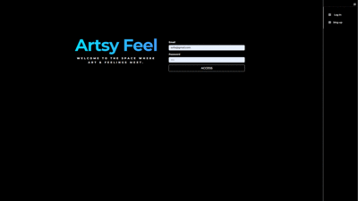
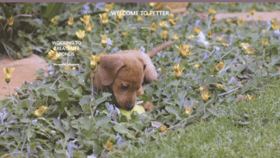
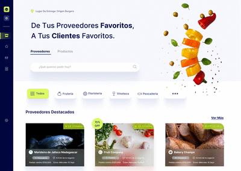

<h2 align="center">
 <a href="https://artsy-feeling.netlify.app/feed"> 🔹ArtsFeel </a></h2>
 

 
 

 
                                                   

 Is a social network that combines art and emotions. The platform has been built using JavaScript, React, MongoDB and its layout has been designed using CSS and Bootstrap.

 
<h2 align= "center">
 <a href="https://nameless-frost-7189.fly.dev/"> 🔹PETTER </a> </h2>
 

 
 

 
 
  
 
A website for pet adoptions, It was made utilizing technologies such as JavaScript, MongoDB, Handlebars, and integrating the Google MapsAPI,geocoding, local places, and autocomplete feature. The layout was designed using Bootstrap and CSS. .

<h2 align="center">
<a href="https://csabogalortiz.github.io/GOMEZ-SABOGAL-GAME/"> 🔹Star Ninja </a></h2>
  

 
 

 

 An infinite platform game inspired by the famous "Doodle Jump" game. Developed in JavaScript using Canvas, CSS and bootstrap.

<h2 align="center"> Coming soon 👩‍💻 👩‍💻 🏗️ </h2> 

 My teammate Catalina Sabogal and I are currently building and designing an e-commerce platform aimed at businesses looking to buy wholesale products of all types. Our platform, named Appura, is being developed using TypeScript, HTML, JavaScript, and React, and is being designed using CSS and Tailwind CSS. 

 

 
 

 

