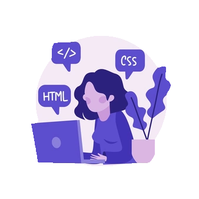

<h1 align="center">Hi 👋, I'm Juliana Gómez Web Developer
</h1>

<h2 align="center"> Welcome to my profile.

</h2>

 <h2 align="center"> 💠  You can see my 
  <a href="https://github.com/Juligs/Juligs/tree/main/PersonalProjects">
 personal projects here👩🏽‍💻 
  </a> </h2>
  
  

<h3 aling ="center" >🔹 Contact me </h3>

<h3 align="left">🔹Languages and Tools:</h3>

             

&nbsp;

